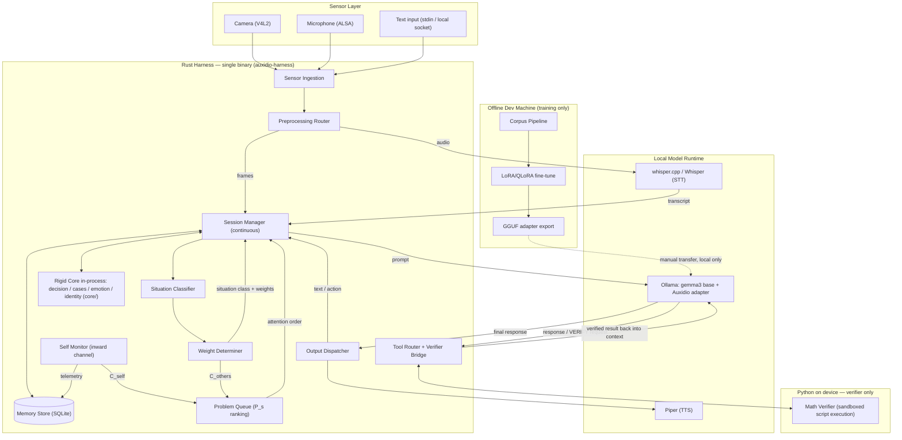
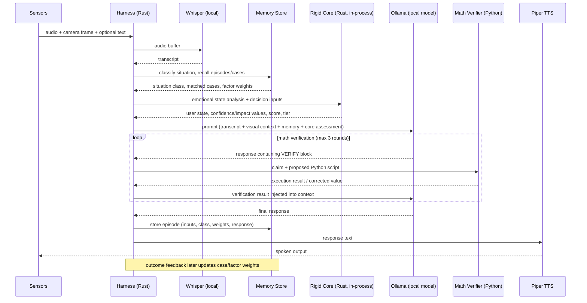

# Auxidio — System Design

## 1. Purpose and Scope

### Mission Constraint

Auxidio exists to help mentally disabled people make better decisions. The device accompanies the person through daily life. Three hard constraints follow directly from that mission and shape everything below:

1. **Fully local, always.** A portable assistive device cannot depend on connectivity. No cloud, at runtime or for training.
2. **The model must fit the device, not the device the model.** Whatever base model is chosen must run on the Orange Pi 6 Plus. The fine-tuned philosophy model is an adapter on that same base — no extra footprint beyond the adapter.
3. **The duty of care extends beyond the user.** When guiding a decision, the system must determine the least harm for *everyone present in the situation*, not just the disabled person. This is why vision is designed for continuous situational awareness rather than on-demand snapshots (see `Rust Harness Design.md` §3).
4. **The device must adapt to the individual.** Speaking rate, mumbling, stuttering, pauses, and processing speed differ per person, so peripheral configuration learns over the life of the device — while the rigid core never adapts (see `User Adaptation.md`).

### Safety Protocol (Locus of Control)

From the vision deck (`Vision Review — Ethical AGI Architecture.md`), three rules prevent the "Master Machine" and are binding on this architecture:

1. **Consent is core.** The service is voluntarily granted by persons of appropriate authority; for the assistive device this means the user and, where applicable, their caregiver.
2. **Earned authority.** Influence beyond the base service is granted by human oversight only after verifiable ethical performance — the system's authority grows from demonstrated outcomes, never from capability.
3. **The steward's role.** Large-scale actions are limited to proposal and communication; humans retain final executive authority. The system recommends; it never acquires, never compels, and never preserves itself against the user.

These are already visible in the concrete design: adaptation announcements with undo, caregiver pins, upgrade requests as evidence-backed proposals, and deferral rights on all self-maintenance requests.

This document set defines the architecture for the next stage of Auxidio:

1. A **Rust harness** that owns the sensor layer (visual, voice, text), runs continuous sessions, and hosts the memory structure.
2. A **Python toolset** that (a) exposes the existing rigid core modules to the harness, (b) verifies the model's arithmetic by executing real Python scripts and feeding results back, and (c) builds a philosophy/religion training corpus with elevated weighting for Emmanuel Levinas.
3. A **localized fine-tuning pipeline** so the base model gains capability in the system's ethical and philosophical framing without ever leaving local hardware.

Governing constraint: **the entire architecture is localized.** No cloud inference, no cloud training dependency at runtime, no external API calls. Everything runs on owned hardware — the Orange Pi 6 Plus target, plus an optional local development machine used only for offline fine-tuning.

This design inherits everything established in `Auxidio- Design Decisions and Reasoning.md` and `Core Design Principles.md`:

- The 50/30/20 weighted decision core is **rigid and unchanged**.
- Learning happens in the layer beneath the core (case library / memory structure), never in the core itself.
- Peripherals are modular and replaceable; the core is stable.
- Least harm, not greatest good.
- Principle 2 (do not reinvent the wheel) applies throughout: existing components — Ollama, Whisper/whisper.cpp, Piper, SQLite — are kept and reused.

---

## 2. Component Overview

| Component | Language | Role | Status |
|---|---|---|---|
| `auxidio-harness` | Rust | Sensor ingestion (vision/voice/text), session management, memory structure, context GC, routing | New |
| `auxidio-core` | Rust | 1:1 port of the rigid core (`decision_engine`, `case_library`, `emotional_framework`, `identity`), pinned to the Python reference by differential tests | New (early port) |
| Math Verifier | Python | Sandboxed execution of model-proposed arithmetic scripts; results fed back to the model. Python stays on-device for this because the point is executing *real Python scripts* | New |
| Corpus Pipeline | Python (offline) | Collect, normalize, weight, and export philosophy/religion training data (Levinas weighted higher) | New |
| Fine-tuning step | Python (offline) | LoRA/QLoRA on a local dev machine; export GGUF; load into local Ollama | New |
| Ollama | Existing | Local model runtime (currently `gemma3:1b`, multimodal — used for both text and vision) | Kept |
| Whisper / whisper.cpp | Existing | Local speech-to-text | Kept |
| Piper | Existing | Local text-to-speech | Kept |
| SQLite | Existing | Case library; extended to become the memory store | Kept, extended |
| Original `.py` core modules | Python | Retained at repo root as the reference implementation and differential-test vector generator | Kept, frozen |

---

## 3. Architecture (All Local)



Key property: every solid arrow at runtime stays on the machine. The only dashed arrow is the offline, human-supervised transfer of a trained adapter file.

---

## 4. Runtime Data Flow — One Interaction



---

## 5. Why This Split

- **Rust for the harness** because it owns long-lived, concurrent, hardware-facing work (sensor streams, session state, supervision) where memory safety without a GC matters on SBC-class hardware. It routes, schedules, and remembers.
- **The rigid core is ported to Rust early — and the Python original is kept.** The core modules are ~1,100 lines of settled logic and nothing downstream depends on their being Python, so the port is cheap *now* and expensive later. The port lives in its own top-level folder, `core/`, as the better, deployable core: single binary on the device, no Python runtime for the decision path, no IPC on the hottest code path. The original `.py` modules stay at the repo root untouched — frozen as the reference implementation and the source of differential-test vectors the Rust port must match exactly. Rigidity is preserved by proof of identical behavior, not by keeping one language.
- **Python stays on device for one job.** The Math Verifier must execute *real Python scripts* — that is the whole point of the verification mechanism — so a minimal Python runtime remains for that sandboxed purpose only.
- **The model is a component, not the system.** The LLM generates language; the core scores decisions; the memory store supplies context; the verifier checks arithmetic. No single component is trusted with the whole answer — consistent with the 50% truth gate: claims (including numeric ones) are checked, not assumed.

---

## 6. Hardware and Deployment

| Concern | Decision |
|---|---|
| Target device | Orange Pi 6 Plus (per design docs). The device is the fixed constraint — the model must fit it |
| Model runtime | Ollama, local models only. Currently `gemma3:1b`; realistically up to a ~3-4B quantized model as RAM/NPU usage allows. Multimodal base covers vision without a second model. The philosophy model = same base + fine-tuned adapter, nothing larger |
| Vision | Continuous ambient awareness with escalation during active guidance situations; raw frames in a rolling buffer only (see `Rust Harness Design.md` §3) |
| STT | Whisper/whisper.cpp loaded once at startup (fixes the known reload-per-use defect from Roadmap Phase 7) |
| TTS | Piper, local voice files |
| Storage | Two tiers: in-process working memory (RAM) + SQLite durable store, with a consolidation loop. ACID configured explicitly (WAL, synchronous=FULL, one-turn-one-transaction); smooth restart via checkpoint + episode replay. No external database server, no Redis daemon — `Memory and Weighting.md` §9-10 |
| IPC | Newline-delimited JSON over stdio between harness and Python child processes. No network sockets required; localhost-only if sockets are ever used |
| Training hardware | Separate local dev machine (whatever GPU is available). Output is a GGUF adapter file transferred by hand. Training never runs on the target during normal operation |

---

## 7. Proposed Repository Layout

```
Auxidio-Core/
├── Cargo.toml                   # Rust workspace root: members = ["core", "harness/*"]
├── core/                        # the better core — Rust port of the rigid core (new)
│   ├── src/                     #   decision, cases, emotion, identity
│   └── tests/differential.rs    #   must match the frozen Python reference exactly
├── harness/                     # Rust harness (new)
│   ├── auxidio-harness/         #   main binary: sensors, session, routing
│   └── harness-core/            #   shared types, verifier IPC protocol
├── python/                      # Python tooling (new)
│   ├── math_verifier/           #   sandboxed script execution service (on-device)
│   └── corpus/                  #   training corpus pipeline (offline dev machine)
├── models/                      # Ollama Modelfiles + adapter metadata (no binaries in git)
├── peripherals/                 # existing containerized peripheral slots
├── decision_engine.py           # original Python core — frozen reference, kept untouched
├── case_library.py              # original Python core — frozen reference, kept untouched
├── emotional_framework.py       # original Python core — frozen reference, kept untouched
├── identity.py                  # original Python core — frozen reference, kept untouched
└── auxidio.py                   # existing Phase 5 integrator (kept until harness supersedes it)
```

Two places hold core logic and they have different jobs: the original `.py` modules at the root are the frozen reference (source of truth for behavior, source of test vectors, readable record of the design), and `core/` is the better core — the same logic, ported, proven equivalent, and shipped as part of the single Rust binary.

The existing `auxidio.py` conversational loop stays runnable throughout the build. The harness supersedes it incrementally; it is not deleted until the harness passes the same end-to-end behavior.

---

## 8. Document Map

| Document | Covers |
|---|---|
| `Rust Harness Design.md` | Sensor ingestion, session manager, IPC contracts, tool routing, crate layout |
| `Memory and Weighting.md` | Memory store schema, situation classification, weight determination flow |
| `Python Tools.md` | Math Verifier sandbox rules, verification loop protocol, corpus pipeline pointer |
| `Training Corpus Plan.md` | Sources, licensing, Levinas weighting, dataset construction, fine-tune and evaluation plan |
| `User Adaptation.md` | Configuration that learns: profile schema, adaptation loop, what may and may not adapt |
| `Self Monitoring and Maintenance.md` | Inward channel: self-telemetry, health ledger, power/thermal/replacement/upgrade requests |
| `Vision Review — Ethical AGI Architecture.md` | Review of the Oct 2025 vision deck: concept map, integrations (P_s queue, C_self/C_others, accountability loop), open questions |

---

## 9. Open Questions — Resolved

1. **Base model growth path.** Resolved: the device is the fixed constraint. The model must fit the Orange Pi 6 Plus because this is a local assistive device for daily life. Larger models are adopted only if they fit; the architecture is model-agnostic behind Ollama either way.
2. **Vision duty cycle.** Resolved: continuous situational awareness is required, because least-harm judgment must cover everyone present in a situation, not just the user. Design is continuous ambient capture with escalation during active guidance situations — `Rust Harness Design.md` §3.
3. **Session persistence across restarts.** Resolved: sessions resume from the memory store per the resume contract in `Rust Harness Design.md` §4.
4. **Levinas text acquisition.** Resolved: legally owned/licensed copies only (`Training Corpus Plan.md` §2).
5. **Porting the core to Rust.** Resolved: port it now, early, while it is cheap (~1,100 lines, nothing depends on its being Python). The port lives in its own top-level folder `core/` as the better core; the original Python modules stay at the repo root untouched as the frozen reference, and differential tests prove the port behaves identically. See `Rust Harness Design.md` §9.

---

_(System design drafted by the assistant from a full codebase and design-document read at the designer's request. All architecture is proposed and submitted for review.)_
