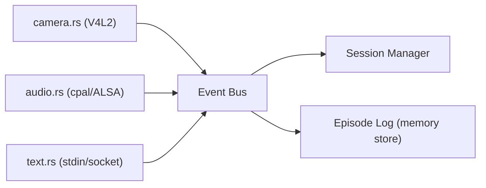
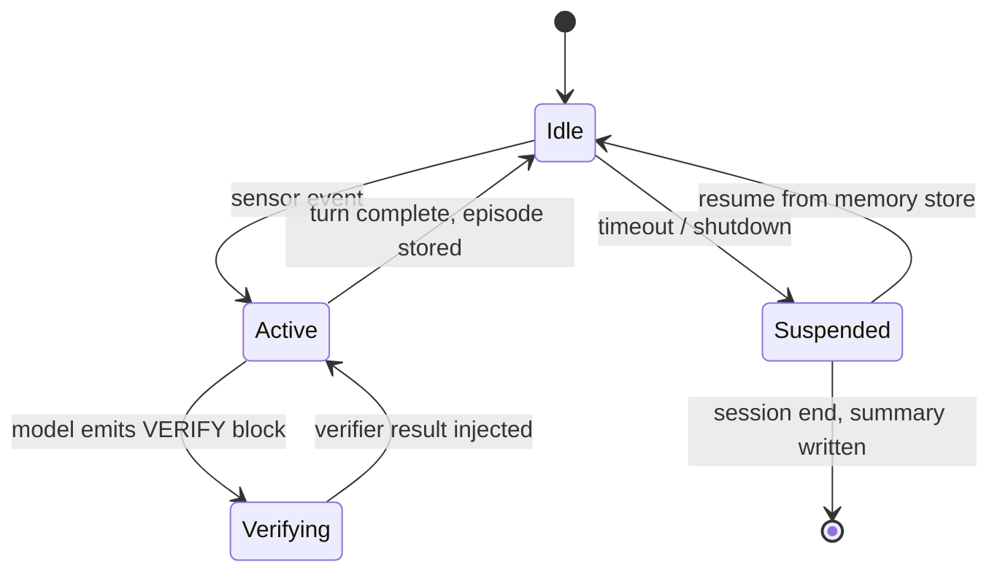
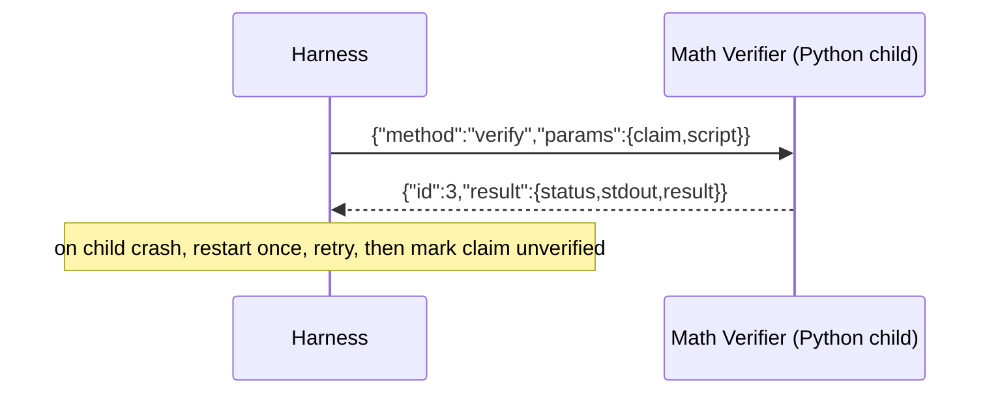
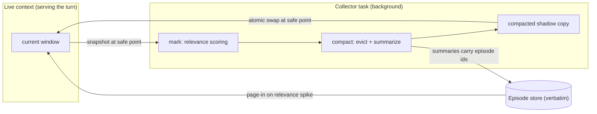

# Auxidio — Rust Harness Design

The harness is the body around the rigid core. It owns sensors, sessions, memory access, and routing. It contains no ethical logic of its own: every judgment passes through the rigid core (`auxidio-core`, the Rust port of the frozen Python reference) or the decision weights stored in the memory structure.

---

## 1. Responsibilities

1. **Sensor ingestion** — camera (V4L2), microphone (ALSA), text (stdin / local socket). Each sensor is a swappable module behind a common event trait, matching the modular-periphery principle.
2. **Preprocessing** — audio to Whisper (once-loaded), camera frames to the multimodal model on demand, text passed through.
3. **Continuous session management** — one session at a time, rolling context, resumable from the memory store after restart.
4. **Memory access** — reads/writes the SQLite memory store; invokes the situation classifier and weight determiner (see `Memory and Weighting.md`).
5. **Model orchestration** — builds prompts from sensor context + memory + core assessment; calls Ollama locally; runs the math-verification loop when the model emits a VERIFY block.
6. **Rigid core (in-process)** — owns the Rust port of the rigid core modules as the `auxidio-core` crate. Direct function calls inside the binary; no IPC on the decision path.
7. **Verifier bridge** — supervises the Math Verifier Python child process; newline-delimited JSON over stdio. Python remains on device for this one job: executing real verification scripts.
8. **Output dispatch** — Piper TTS for speech, text/action channels for everything else.
9. **Problem queue** — when multiple problems are open at once (user request, detected situation, own maintenance request), rank attention by P_s (see §10).
10. **Context manager** — background garbage collector and compressor for the model window; never interrupts an in-flight interaction (see §11).

Non-responsibilities: the harness does not *invent* ethical logic. The core's logic is ported 1:1 from the frozen Python reference at the repo root, and differential tests prove the port behaves identically (see §9).

---

## 2. Crate Layout

```
Auxidio-Core/
├── Cargo.toml                  # workspace root: members = ["core", "harness/*"]
├── core/                       # the better core — 1:1 Rust port of the rigid core
│   ├── src/
│   │   ├── decision.rs         #   decision_engine.py  (weights, tiers, proportionality)
│   │   ├── cases.rs            #   case_library.py     (store, similarity, outcomes, security log)
│   │   ├── emotion.rs          #   emotional_framework.py (inward + outward channels)
│   │   └── identity.rs         #   identity.py         (device identity persistence)
│   └── tests/
│       └── differential.rs     #   runs the Python-generated vectors, requires exact match
└── harness/
    ├── harness-core/           # shared types + IPC protocol (no I/O deps)
    │   └── src/lib.rs          #   event, sensor frame, session, memory record,
    │                           #   JSON-RPC message types, VERIFY block grammar
    ├── auxidio-harness/        # main binary
    │   └── src/
    │       ├── main.rs         # startup, config, supervision
    │       ├── sensors/        # camera.rs, audio.rs, text.rs, trait SensorSource
    │       ├── preprocess.rs   # whisper invocation, frame selection
    │       ├── session.rs      # SessionManager: rolling context, turn loop
    │       ├── memory.rs       # SQLite access (rusqlite), migrations
    │       ├── classify.rs     # situation classifier client (fast path + model fallback)
    │       ├── weights.rs      # weight determiner client
    │       ├── verifier.rs     # Math Verifier child process + JSON-RPC
    │       ├── tools.rs        # tool router: VERIFY block parsing, verifier dispatch
    │       ├── model.rs        # Ollama client (local HTTP on localhost only)
    │       └── output.rs       # Piper TTS + text/action dispatch
    └── xtask/                  # optional: build/run helpers, vector generation
```

The Python vector generator lives under `xtask` (or `python/` tooling) and runs the frozen reference modules to emit test vectors; `auxidio-core` consumes them. Open testing parameters (thresholds, `exponent`, `MIN_OUTCOME_SCORE`, keyword lists) are config values in the port, so tuning does not require recompiling the rigidity — only the numbers move, never the logic.

Suggested dependencies (all local, no network services): `rusqlite`, `serde`/`serde_json`, `tokio` (async runtime), `v4l` (camera), `cpal` (audio capture), `ollama-rs` or a thin local HTTP client. Final crate selection during implementation, favoring mature crates with no network obligations (Principle 2).

---

## 3. Sensor Ingestion



Common contract:

```rust
pub enum SensorEvent {
    AudioChunk { pcm: Vec<f32>, sample_rate: u32 },
    UtteranceComplete { transcript: String },
    Frame { image: EncodedFrame, trigger: FrameTrigger },
    Text { content: String, source: TextSource },
}
```

- **Audio**: push-to-talk retained initially (existing behavior), VAD-assisted turn detection later. Audio buffers accumulate in the harness; transcription is requested once per utterance, not per chunk.
- **Vision — continuous situational awareness.** The duty of care extends to everyone present in a situation, so vision is not snapshot-on-request. It runs as a two-tier duty cycle:
  - *Ambient path (always on, cheap):* low-rate capture (~1-2 fps, downscaled) with on-device motion/change detection. This is how the system notices that a situation is arising.
  - *Active situation window:* when the situation classifier flags a guidance situation, ingestion escalates to full-rate frames for the duration of the episode, so the least-harm assessment sees the whole situation as it unfolds — for the user and everyone else present.
  - *Privacy:* raw frames live only in a rolling buffer (configurable window, e.g. minutes, not days). The episodic store keeps frame *references and text summaries*, never footage.
- **Text**: direct input channel for typed interaction and for future peripheral containers posting events.

Every `SensorEvent` is appended to the episode log before processing, so memory reflects raw reality, not just processed summaries (feeds the truth-first principle: the record of what actually happened is preserved).

---

## 4. Session Manager — Continuous Sessions

A session is the unit of continuous interaction. It survives across turns and across process restarts.



Session state held in memory and mirrored to the store:

- `session_id`, started/resumed timestamps
- rolling context window (last N turns, token-budgeted) sent to the model each turn
- current situation class + active weights (from classifier/weight determiner)
- pending verification requests
- pointer to the matched case(s) used this session, so outcome feedback can be attributed later

**Resume contract:** on startup, the harness reads the most recent non-ended session from the memory store, reloads its rolling context, and announces readiness. No user-visible state is lost across a restart.

---

## 5. IPC — Math Verifier Only

The rigid core is in-process: the harness calls `auxidio-core` functions directly. No serialization, no child process, no supervision on the decision path — this is one of the concrete wins of the early port.

The only Python child process left is the Math Verifier, and it exists because executing *real Python scripts* is the verification mechanism itself. Protocol: newline-delimited JSON over stdin/stdout; requests carry an `id`, responses echo it.



Rules:

- The verifier contract in `harness-core` is the only Rust↔Python runtime surface.
- The verifier gets generous but finite timeouts; a hung tool degrades the turn (reported honestly to the user) rather than blocking the session — per Roadmap Phase 8 error-containment intent.
- No network. stdio IPC means the verifier is unreachable from outside the machine by construction.

---

## 6. Model Orchestration and the VERIFY Loop

The harness builds each prompt from four inputs: sensor context (transcript + frame reference), memory context (situation class, matched cases, prior turns), core assessment (tier, score, communication style), and the verification protocol instructions.

When the model's response contains a VERIFY block (strict fenced JSON grammar defined in `harness-core`), the tool router:

1. extracts `claim` and `script`,
2. sends them to the Math Verifier,
3. injects the execution result back into context,
4. re-queries the model, up to 3 rounds; after that the last verified numbers are stated as such, and any remaining mismatch is surfaced honestly ("I could not verify this calculation") rather than smoothed over — truth gate first.

Full loop detail is in `Python Tools.md`.

---

## 7. Configuration

All hardware-specific values move to a config file at the repo root (`harness.toml`), fixing the hardcoded-paths defect from Roadmap Phase 7 by design: device indices, mouse device path, DB paths, Piper voice path, Ollama endpoint (localhost only), model name, timeouts, session context budget, verification round limit.

Config is layered and hot-reloaded, because the device must adapt to its user mid-session (`User Adaptation.md`): `harness.toml` defaults < learned adaptations (memory store) < caregiver/user pins < session overrides. No component caches these values at startup; the session manager reads them per turn.

---

## 8. Build Order

1. `harness-core` types + verifier protocol (compile-only milestone).
2. `auxidio-core`: the Rust port of the rigid core + differential vectors generated from the frozen Python reference. First independently verifiable milestone — needs no sensors, no model, nothing else.
3. `memory.rs` schema + migrations (see `Memory and Weighting.md`).
4. Text-only session loop (no sensors) against Ollama, using the in-process core — continuous session proven.
5. Audio sensor + Whisper integration — parity with `auxidio.py`.
6. Vision duty cycle (ambient path + active situation window).
7. VERIFY loop with the Math Verifier.
8. `auxidio.py` retirement check: harness must reproduce the Phase 5 behavior before the old integrator is deprecated.

9. Problem queue (P_s) once the classifier and self monitor produce scores — multi-problem sessions ranked.

Each step has an independently demonstrable outcome, per Principle 6 — this is not a race. Step 2 comes first precisely because the port is cheap now and everything after it builds on the better core.

---

## 10. Problem Queue and Priority (P_s)

With continuous situational awareness, a session can hold several open problems at once. The vision deck's priority score ranks them:

`P_s = (C_self + (C_others × M_impact)) / M_Level`

Inputs: `C_self` from the Self Monitor; `C_others` from the situation classifier + outward channel + head count (device-scope definition, `Vision Review` §4.2); `M_impact` = people affected; `M_Level` from the encoding below. All four are config-level open testing parameters.

| M_Level | Need class | Examples |
|---|---|---|
| 1 | Physiological / life-safety | injury, fire, acute crisis |
| 2 | Security | shelter, threat, stability |
| 3 | Belonging | isolation, conflict, relationships |
| 4 | Esteem / capability | confidence, competence |
| 5 | Growth | planning, learning, goals |

Cross-level problems take their **lowest** level involved — a hungry child is Level 1 whatever else is true. Tradeoffs between groups or levels are adjudicated by `score_decision`'s proportionality logic; P_s only orders attention.

**Truth-gate interaction — the rule that keeps urgency honest:**

- P_s ranks what gets attention; the confidence tier decides what *kind* of action follows.
- `gather_more_data` never means paralysis: it means the next action is epistemic — ask, observe, verify. In a crisis, the right question *is* the action.
- No decisive action on unverified premises regardless of P_s. A high-priority guess is still a guess.

Open problems are re-scored each turn; resolved ones close into episodic memory and, where significant, into `PROBLEM_RECORDS` (`Memory and Weighting.md` §8).

---

## 11. Context Window Management — the Garbage Collector

### 11.1 The problem

Continuous sessions, vision context, verification loops, and memory injection fill any context window; on SBC hardware a long window also slows every inference. The window must stay small and relevant, and its management must never pause or interrupt an interaction in flight — the user's voice response keeps flowing while compaction happens in the background.

### 11.2 Context as memory: roots, heap, backing store

The GC analogy is the design:

- **Roots (pinned, never collected):** identity + safety protocol + system prompt; every open problem from the P_s queue with its attached context; the current turn; caregiver/user pins.
- **Heap (collectible):** hot verbatim turns; warm summaries; retrieved memory snippets; verification history beyond the latest result.
- **Backing store (disk):** the verbatim episode store. The context is a *view*; the store is truth. Summaries are lossy but recoverable — when a summarized topic spikes in relevance, the verbatim episode is paged back in (a page fault) and pinned while relevant. Lossy where acceptable, lossless where it matters: the same doctrine as the storage tiers (`Memory and Weighting.md` §9-10).

Per-turn token budget, allocated by section:

| Section | Policy |
|---|---|
| Roots | fixed, pinned |
| Open-problem context | pinned while the problem is open |
| Hot turns | elastic, recency-ordered |
| Summaries | elastic, hierarchical |
| Retrieved memory | elastic, relevance-ranked |

### 11.3 The collector: mark, compact, swap

The collector is a background harness task running concurrently with the turn loop. It never touches the live context — it works on a shadow copy, like a copying collector:

1. **Mark.** Relevance scoring via the weight determiner: recency × situation-class match × factor weights × referenced-by-open-problems. Referenced items are roots for as long as the problem stays open.
2. **Compact.** Evict unreachable items; compress evicted-but-significant spans into summaries with a cheap local summarizer (gemma3:270m-class, or extractive templates for structured data — heavier tooling only after demonstrated insufficiency, Principle 2); merge adjacent summaries into higher-level summaries over time (hierarchical compaction).
3. **Swap.** Atomically replace the live context with the compacted shadow copy at a safe point — between model calls, between turns. A pointer swap, not an edit.



### 11.4 Non-interruption guarantees

1. **The collector never mutates the live context mid-turn.** The swap is a pointer exchange at a safe point; an in-flight voice or text response is untouched.
2. **Bounded compute budget.** The collector yields to foreground inference and throttles when C_self reports thermal or load stress — the device's health outranks tidiness.
3. **Hard-cap fallback.** If the window nears its cap before the collector finishes, deterministic truncation of the lowest-relevance items (no model needed, microseconds) keeps the turn flowing; the collector reconciles afterward. Overflow is degraded gracefully, never visibly.
4. **Summaries preserve the load-bearing parts:** decisions made, commitments, names, and numbers (numbers keep the verifier's truth discipline — a summarized quantity is still a claim), and emotional-state transitions. Everything else may compress.

### 11.5 Verification blocks under GC

Only the latest verified result stays hot in the window. Older claim/script/result triples collapse to a one-line marker (`verified` / `mismatched`, value, episode id) with the page-fault path to the verbatim episode. The model keeps its checked arithmetic without paying for its history.

### 11.6 Accountability

Compression touches the view, never the store. Episodes remain verbatim on disk under the ACID rules of `Memory and Weighting.md` §10; if a later decision needs what was summarized away, the page fault restores it. The context is allowed to forget; the system is not.

---

## 9. The Core in Rust — Early Port, Original Kept

Decision: the rigid core is ported to Rust **now**, early, and the original Python is **kept**. Two folders, two jobs.

- The original modules at the repo root (`decision_engine.py`, `case_library.py`, `emotional_framework.py`, `identity.py`) are **kept untouched**. They become the frozen reference implementation and the source of truth for behavior.
- The port lives in its own top-level folder, `core/`, as the **better core** — the one that ships, in-process, inside the single Rust binary.

### Why now and not later

The objection to porting was always "you do not translate a moving target." But the designer's point stands: at this stage nothing downstream depends on the core being Python, and no other component has been built against a Python-only contract yet. Porting now is ~1,100 lines of settled logic. Porting later means tearing out a Python Core Service, an IPC bridge, and a supervision layer that would all have been built in between. Early is the cheap moment.

It is also worth keeping the reason honest. **This is not a speed measure.** The core's arithmetic is a handful of floats, a SQLite query, and keyword matching — microseconds. Every turn's latency is dominated by model inference and speech, which are seconds. Porting for speed would be theater. The real reasons are deployment reasons:

- **Single binary on the device.** No Python runtime, no venv, no child-process supervision, no IPC serialization on the decision path. Smaller footprint on SBC hardware, fewer things that can fail in an assistive device that must just work.
- **One language to maintain** in the shipped system.

### What keeps the port honest

Rigidity is preserved by proof of identical behavior, not by keeping one language:

1. **The Python reference is frozen.** No behavior changes are made to the `.py` modules from this point. Any future change to core behavior is made in *both* implementations at once, with the Python side updated first as the reference.
2. **Differential vectors are generated from the Python side.** A generator runs the reference modules and emits vectors covering decision tiers and their exact boundaries, weighted-score rounding, proportionality outcomes, similarity scoring, cumulative-average outcome updates, removal thresholds, security-log escalation counts, and every user-state/communication-style mapping in the emotional framework.
3. **The Rust port must match exactly.** `core/tests/differential.rs` consumes the same vectors; any divergence is a bug in the port, full stop.
4. **Open testing parameters stay movable.** Thresholds, `exponent`, `MIN_OUTCOME_SCORE`, and keyword lists are config values in the port, so tuning does not require recompiling the rigidity — only the numbers move, never the logic.

Principle 3 applies: build toward the core's *function*, and the function is verified by the differential suite, not by the language it is written in. Principle 2 applies to the original itself: it is proven, so it is kept — as the reference the better core must answer to.
