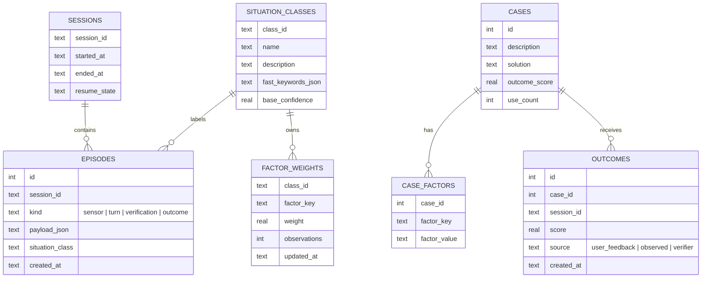
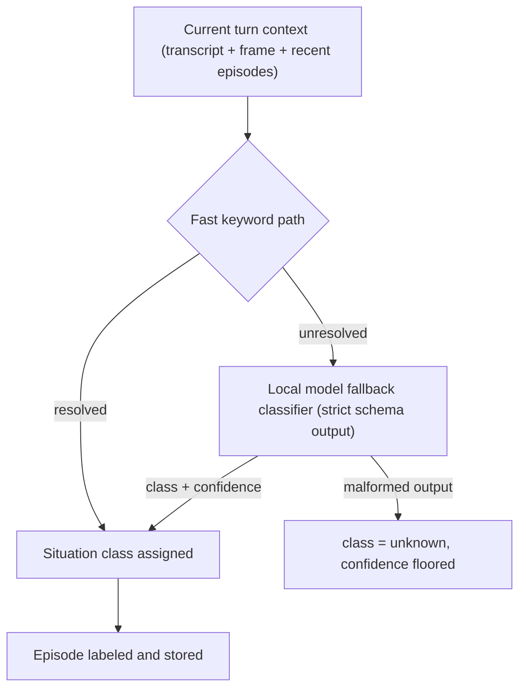
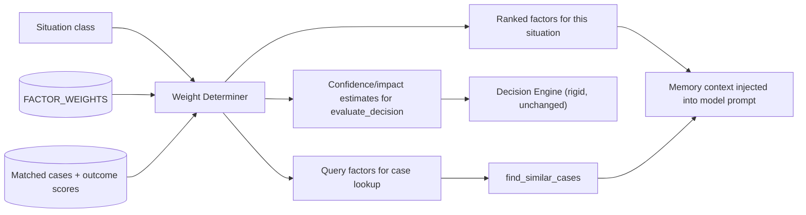
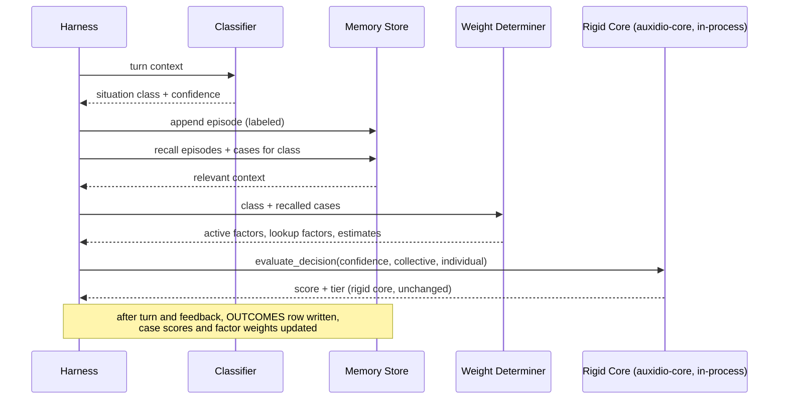
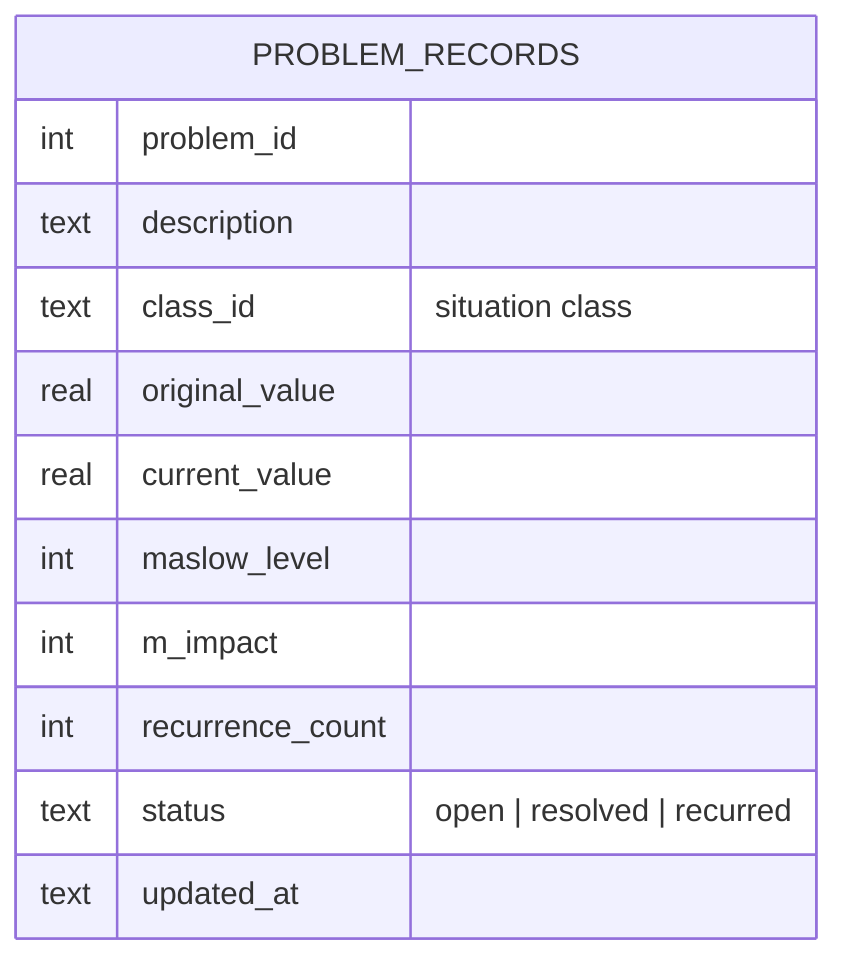
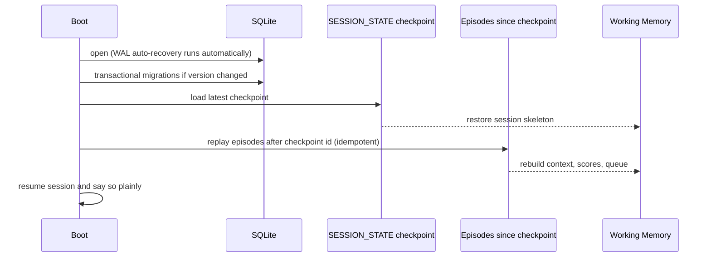

# Auxidio — Memory Structure, Situation Classification, and Weight Determination

The memory structure is what makes sessions continuous and judgment consistent over time. It extends the existing case library concept into a full store with three layers, and it is where all *learned* weights live. The rigid core's base weights (50/30/20) never live here and never change.

---

## 1. Three Memory Layers

| Layer | Content | Analogy | Mutability |
|---|---|---|---|
| Episodic | Raw and processed event log: every sensor event, transcript, frame reference, turn, and outcome | What happened | Append-only, never rewritten |
| Semantic | Distilled cases, situation classes, factor definitions — extends the existing `cases` table | What it means / what worked | Updated by outcome feedback |
| Working | Current session: rolling context, active situation class, active weights, pending verifications | What is happening now | Per-session, resumable |

The episodic layer is append-only by design: the truth gate (50%) requires an untampered record of what actually occurred. Semantic memory may be revised; history may not.

**How the user's life becomes second nature to the system.** Not by retraining the model on-device — the model stays frozen. The mechanism is this memory layer: every turn is shaped by episodic recall, matched cases, and learned factor weights. The longer the system accompanies a person, the more its learned layer encodes that person's patterns, routines, and recurring situations. The model supplies the philosophy; the memory supplies the personal knowledge. This is the same two-layer doctrine as the core: the fixed part stays fixed, and the personal learning happens in the layer beneath it.

---

## 2. Schema (SQLite, extends `case_library.py` tables)

Existing `cases` and `security_log` tables are preserved exactly; `CASE_FACTORS` normalizes the current JSON `factors` column over time without breaking `find_similar_cases`.

The store is further extended by `USER_PROFILE`, `ADAPTATIONS`, and an append-only `ADAPTATION_LOG` — the learned-configuration tables that let the device adapt to its user's speech and pacing. Their schema, resolution order, and audit rules are defined in `User Adaptation.md` §3-4.

---

## 3. Situation Classification

Two-path design, matching Roadmap Phase 8's harden-the-classifier intent:

- Fast path: per-class keyword/feature rules (extends the existing outward-channel keyword approach). Cheap, immediate.
- Fallback: the local model returns `{class_id, confidence}` against a strict schema. Malformed output never crashes the turn — the situation is marked `unknown` and the confidence gate in the decision engine handles the rest. This is deliberate: an uncertain system that knows it is uncertain is safer than a confident one that is wrong.
- New classes can be created by the fallback when no existing class fits, but start with zero learned weights and must earn usage before their weights carry influence.

---

## 4. Weight Determination

Two kinds of weight exist and must never be conflated (per the design documents' two-layer architecture):

1. **Base weights** — truth 0.5, collective 0.3, individual 0.2. Fixed in `decision_engine.py`. The weight determiner never touches these.
2. **Factor relevance weights** — learned, per situation class, stored in `FACTOR_WEIGHTS`. These decide which situational details matter for this class of problem and feed similarity matching and case ranking.

Learning rule: weights update only through recorded outcomes (`OUTCOMES` table), via the same cumulative-average mechanism `update_outcome` already implements. No weight changes without evidence. Open testing parameter, same as elsewhere: update rate and decay.

---

## 5. Turn Flow Through Memory

---

## 6. Outcome Feedback Sources

1. **Explicit user feedback** — the Roadmap 6.2 confirmation cue ("Did that help?").
2. **Observed outcomes** — later episodic evidence that a recommended action was taken and what followed (pattern-matched by the classifier; conservative scoring).
3. **Verifier outcomes** — for arithmetic claims, the Math Verifier's pass/fail is itself an outcome signal for the truth dimension of the turn.

All three write to the same `OUTCOMES` table with distinct `source` values, so the learning layer has one mechanism regardless of signal origin.

---

## 7. Privacy and Localization

- The memory store never leaves the device. No sync, no cloud backup by default.
- Episodic data is the user's private record: retention window and purge controls are a config setting, not an afterthought.
- The store is plain SQLite on local storage; encryption-at-rest is a documented follow-on, not a launch blocker (recording as an open item rather than pretending it is solved).
- Continuous vision is the most sensitive data stream in the whole system — a device that watches over a vulnerable person constantly. Raw frames therefore exist only in a rolling buffer (minutes, configurable) and are never written to the episodic store; the store keeps frame references and text summaries. The system remembers the situation, not the footage.

---

## 8. Problem Records — Permanent Memory

Separate from the case library, per the vision deck's accountability loop. The case library scores *solutions* and culls bad ones. Problem records preserve the *significance of problems* and never forget:

- **Failure** (problem recurs after a resolved outcome): re-enters at 110% of its last value.
- **Success**: value decays to 90% of its last value.
- **Floor**: never below 101% of the original value — the lesson is never completely forgotten.

**Problem identity:** recurrence matching reuses the existing similarity machinery (situation class + factor fingerprint), the same mechanism as case lookup — no new matching logic.

**Feeds P_s:** open problem records contribute to the observed-stressor sum behind C_others, so a problem that keeps recurring weighs more each time — exactly the deck's intent.

**Why separate from cases:** culling bad solutions is hygiene; forgetting significant problems is amnesia. The deck's 101% floor and the case library's `MIN_OUTCOME_SCORE` removal answer different questions and must not share a table.

---

## 9. Storage Tiers — Working Memory and Consolidation

The designer's question: should Redis hold hot data in RAM, with data that becomes routine pushed down into SQLite? **The tiering is correct; Redis is the wrong implementation for this device.**

### Why not Redis

- Redis's strengths are multi-process shared access, networked clients, and rich remote data structures. In this architecture exactly one process — the harness — owns the memory. For a single consumer, in-process Rust structures are faster than Redis: no serialization, no socket, no protocol.
- It is another daemon to supervise on an SBC — the same class of complexity the project removed when the core moved in-process. If Redis dies, the hottest path dies with it.
- RAM on the Orange Pi is shared with model inference. Paying Redis's overhead to cache what a struct already holds is paying twice for the same data.
- Two systems holding truth need consistency rules. One durable store plus one volatile cache needs only a flush rule.

### What gets built instead (same intuition, lighter wheel)

- **Working memory (in-process):** session rolling context, active situation class and weights, problem-queue scores, telemetry ring buffer, frame-reference buffer with expiry — Redis's TTL idea adopted as a pattern, not as a daemon.
- **Long-term memory (SQLite):** everything durable, exactly as designed in §2 and §8.
- **Consolidation loop:** a periodic task flushes aggregates and summaries from working memory into SQLite, and promotes repeatedly-relevant items into semantic memory — "the data that becomes routine gets saved into SQL," as proposed. This is the brain's own working-memory/consolidation design (Principle 3).

### The durability rule (the one inversion)

Accountability records — episodes, outcomes, adaptation logs, problem records, security log — are written to SQLite **synchronously at creation**. Volatile RAM never holds the only copy of a truth record: an assistive device loses power, and the truth gate requires the record of what happened to survive it. The fast, ephemeral data (raw telemetry samples, frame references) is precisely what stays in RAM. Hot-but-durable is a contradiction; the tier split is by *accountability*, not by speed.

### Revisit condition

If peripherals later become several separate processes that need a shared bus, a local broker becomes relevant at that point — Principle 2: adopt proven solutions when a genuine insufficiency is demonstrated. The memory tiering itself stays in-process regardless.

---

## 10. ACID, Transactions, and Smooth Restart

The durable tier gets real ACID from SQLite — configured explicitly, never by default. The volatile tier cannot be durable (it is RAM), so it gets smooth restarts the way databases do: checkpoint plus redo replay, with the episodic store as the redo log.

### 10.1 The durable tier: make SQLite's ACID real

Set at open, explicitly:

| Setting | Value | Reason |
|---|---|---|
| `journal_mode` | `WAL` | Crash-safe, and readers (future caregiver tools) never block the writer |
| `synchronous` | `FULL` | Power-loss durability, not merely crash durability — the honest setting for a battery-powered device. Write volume is turn-frequency and small; FULL is cheap here |
| `foreign_keys` | `ON` | Referential consistency enforced by the engine |
| `busy_timeout` | set | No spurious `SQLITE_BUSY` failures on the single writer |

Rules:

- **Single writer connection**, owned by the harness. All writes serialize through it.
- **One turn = one transaction.** A turn that writes an episode, updates a case score, touches a problem record, and logs an adaptation does so inside `BEGIN IMMEDIATE … COMMIT`. A crash mid-turn leaves nothing half-applied — atomicity at the unit that matters.
- **Versioned, transactional migrations.** Schema version in `PRAGMA user_version`; each migration is one transaction. Crash mid-migration rolls it back; next boot re-runs it. The store is never half-migrated.

### 10.2 The volatile tier: checkpoint + redo replay

Working memory is a cache over the durable store, so its recovery is standard database recovery design:

- **Redo log:** episodes are already written synchronously at creation (§9 durability rule) — every input, output, verification, and outcome already survives on disk.
- **Checkpoint:** a `SESSION_STATE` row written every N turns and on graceful shutdown: session id, rolling context window, active situation class and weights, problem-queue scores, pending verifications, last episode id covered.
- **Replay:** at boot, load the latest checkpoint, then replay episodes after its last episode id (idempotent, by id) to rebuild anything the checkpoint predates.

Worst case under a hard power cut: zero accountable data lost (truth records never lived only in RAM), and at most one checkpoint-interval of working state rebuilt by replay.

### 10.3 Graceful shutdown

Signal handlers (SIGTERM/SIGINT) finish the current turn's transaction, write a final checkpoint, close the store. A battery-critical self-request is treated as a shutdown request with the same path (§Self Monitoring). Death by power cut is the fallback path, not the design path — but §10.2 makes the fallback path lossless for anything that matters.

### 10.4 What ACID does not buy

A power cut mid-speech or mid-inference is not a database problem. The session resumes with a plain acknowledgment ("I restarted — we were discussing X") rather than pretending continuity that did not happen. Smooth restart, truth first.
