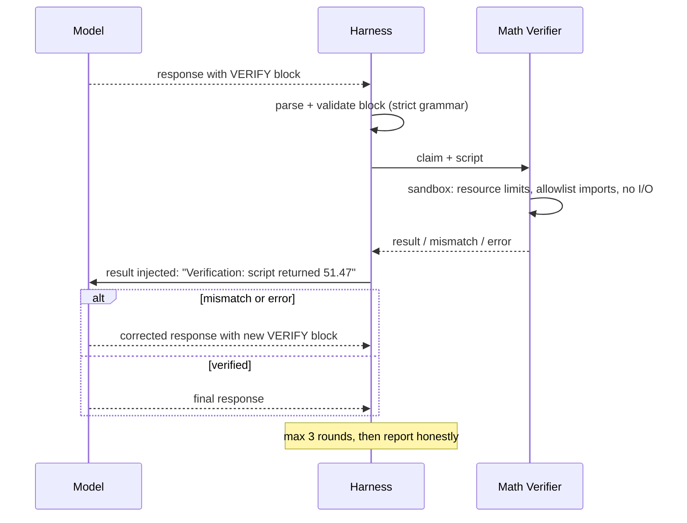

# Auxidio — Python Enhancement Tools

Two Python tool groups remain. The rigid core is no longer one of them: it has been ported into Rust (top-level `core/` folder) as the better core, with the original `.py` modules kept at the repo root untouched as the frozen reference and differential-test source (`Rust Harness Design.md` §9). Python stays in the system for two genuinely Python-shaped jobs: executing real verification scripts on device, and building the training corpus offline.

Also folded into the Rust side: the Roadmap 6.1 fix (no hardcoded 0.8/0.5/0.7 inputs) and the hardcoded `/mnt` path defect — both are resolved by config-driven design in the harness and core port.

---

## 1. Math Verifier

**Purpose:** the model does not do arithmetic alone. Any numerical claim it wants to rely on is executed as real Python and the result fed back. Small models hallucinate arithmetic; interpreters do not.

### 1.1 Protocol

The model is instructed to emit a VERIFY block when a response depends on calculation:

````
```verify
{
  "claim": "The total cost is 3 * 14.99 + 6.50 = 51.47",
  "script": "print(round(3 * 14.99 + 6.50, 2))"
}
```
````

The harness extracts it and calls the verifier:

```json
{"method":"verify","params":{"claim":"...","script":"print(round(3*14.99+6.50,2))"}}
```

Verifier response:

```json
{"result":{"status":"verified","stdout":"51.47","value":51.47,"duration_ms":14}}
```

or, on mismatch (script output contradicts the claim):

```json
{"result":{"status":"mismatch","stdout":"51.47",
 "note":"claim states 49.99, script computed 51.47"}}
```



### 1.2 Sandbox Rules

Execution is `subprocess` with hard limits — the verifier runs model-proposed code, so it is treated as untrusted input:

| Control | Setting |
|---|---|
| Interpreter | Dedicated venv, no user packages required beyond stdlib + `decimal`/`fractions` |
| Imports | Allowlist only: `math`, `decimal`, `fractions`, `statistics`, `datetime`, `itertools`, `functools`. Everything else raises before execution |
| Filesystem/network/subprocess | Blocked — no builtins access to `open`, `os`, `sys`, `subprocess`, `socket`; enforced by restricted execution namespace, not regex filtering |
| CPU / memory / runtime | rlimits: 5s wall clock, 256MB, no child processes |
| Output contract | Script must `print` exactly one final line; that line is the claimed value |

Failure modes are all handled as honest signals: timeout, syntax error, runtime error, and non-numeric output each produce a structured status the model can react to. A claim that cannot be verified is reported as unverified, never silently accepted — truth gate first.

### 1.3 Scope

Phase 1 is arithmetic and unit conversion (the realistic failure surface of a 1B model). The allowlist is designed so symbolic/geometry libraries can be added later without protocol changes — but only after a demonstrated insufficiency (Principle 2).

---

## 2. Corpus Pipeline

**Purpose:** build the philosophy/religion training dataset that enhances the model's alignment with Auxidio's ethical framing, with Emmanuel Levinas weighted higher than other sources.

Full source list, licensing policy, weighting table, dataset construction, and fine-tuning plan are in `Training Corpus Plan.md`. The pipeline itself lives in `python/corpus/` with four stages: **ingest → normalize → register (source + weight) → export (weighted JSONL)**.

The pipeline is deliberately separate from the runtime system: it runs on the offline dev machine, produces a dataset, and stops. Training and GGUF export are downstream steps documented in the corpus plan.

---

## 3. Process Supervision Summary

| Tool | Lifetime | Started by | Restart policy |
|---|---|---|---|
| Math Verifier | Harness lifetime | Harness | Restart once; if down, VERIFY blocks are marked unverified |
| Corpus Pipeline | One-shot | Human, offline | N/A |

No tool opens a listening network port. Everything is stdio or filesystem on the local machine.
