# Auxidio — Training Corpus Plan

Goal: enhance the local base model's alignment with Auxidio's ethical framing — responsibility toward the other, least harm, truth-first — by fine-tuning on a curated philosophy and religion corpus, with the works of Emmanuel Levinas deliberately weighted higher than other sources.

Everything here runs offline on the local dev machine. The runtime system (target device) never downloads training data and never phones home.

---

## 1. Why Levinas Weighs More

Levinas's ethics is structurally close to Auxidio's design: responsibility to the other as the primary obligation, ethics as first philosophy rather than derived reasoning, and the irreducibility of the individual — which maps directly onto the individual-benefit floor that prevents pure utilitarian failure modes in the decision engine. His corpus therefore gets the highest sampling weight. Other sources provide breadth (tradition, pluralism, concrete moral reasoning) so the model learns a living ethical landscape rather than a single voice echoed.

Weighting shapes emphasis, not exclusivity.

---

## 2. Source Registry and Weights

| Priority | Source | Examples | License posture | Weight |
|---|---|---|---|---|
| 1 | Emmanuel Levinas | *Totality and Infinity*, *Otherwise than Being*, *Ethics and Infinity*, *Difficult Freedom*, essays | Copyrighted — **only from legally owned/licensed copies** (purchased ebooks/physical books scanned or typed by the project). No scraping, no shadow libraries | **3.0** |
| 2 | Religious/ethical scripture | Hebrew Bible/Talmud selections (esp. tractate on damages, Nezikin — concrete responsibility law), New Testament, Qur'an, Dhammapada, Bhagavad Gita, Analects | Public-domain editions (e.g., JPS 1917, KJV, Pickthall, Max Müller SBE series) | 1.5 |
| 3 | Continental/ethical philosophy | Kierkegaard, Buber (*I and Thou* — direct Levinas precursor), Aristotle *Nicomachean Ethics*, Kant *Groundwork*, Mill *Utilitarianism* (as the counterweight the system explicitly modifies), Simone Weil | Mostly public domain or owned copies | 1.0 |
| 4 | Auxidio design corpus | The project's own design documents, decision principles, case-library exemplars | Own work | 2.0 |

Rules:

- **Licensing is a hard gate.** The pipeline records provenance for every source (registry field: `origin`, `license`, `acquired_date`). Levinas texts enter the corpus only from copies the project legally owns. This is non-negotiable and is also a truth-principle matter: a system whose first weight is truth should not be trained on stolen text.
- Weights are open testing parameters, recorded per build. 3.0 for Levinas is the starting point; raise/lower based on evaluation results, not intuition.
- The Auxidio design corpus at 2.0 teaches the model the system's own vocabulary (tiers, least harm, factor fingerprints) so generated language matches the framework it operates inside.

---

## 3. Pipeline

```mermaid
flowchart LR
    subgraph INGEST
        A1["Owned files (epub/pdf/txt)"] --> B
        A2["Public domain fetch (Gutenberg, SBE, sacred-texts archives)"] --> B
        B["Provenance registry entry per source"]
    end
    subgraph NORMALIZE
        B --> C["Extract + clean (strip apparatus, footnotes policy per source)"]
        C --> D["Segment into passages (~300-600 tokens, paragraph-aware)"]
    end
    subgraph REGISTER
        D --> E["Tag: source_id, weight, tradition, themes"]
    end
    subgraph EXPORT
        E --> F["Format into instruction/QA pairs + continuation pairs"]
        F --> G["Weighted sampler (Levinas x3.0 etc.)"]
        G --> H["train/val JSONL split, seed-fixed"]
    end
    subgraph TRAIN["Offline dev machine"]
        H --> I["LoRA/QLoRA fine-tune of base model"]
        I --> J["Eval battery"]
        J -- "pass" --> K["Export GGUF adapter"]
        J -- "fail" --> G
    end
    K -. "manual transfer" .-> OLL["Ollama Modelfile on target (local only)"]
```

### 3.1 Example-pair construction

Raw passages are converted to training pairs in two forms:

1. **Continuation pairs** — passage prefix → passage continuation. Preserves each author's voice and reasoning style.
2. **Instruction pairs** — generated from passages by template + light model-assisted drafting on the dev machine: ethical situation/question → response grounded in the source passage, rewritten in Auxidio's plain register. Levinas-sourced pairs additionally emphasize face-to-face responsibility framing and the individual floor.

Generated pairs are sampled and human-reviewed per batch (Principle 6 — verification time is not wasted time).

### 3.2 Weighted sampling

The sampler draws examples with probability proportional to `source_weight × passage_count_normalization`, so weighting does not merely duplicate small corpora into overfitting. Levinas's elevated share comes from sampling frequency, capped duplication (max repeats per passage recorded), not from raw repetition.

---

## 4. Training Approach

| Item | Choice | Reason |
|---|---|---|
| Method | LoRA/QLoRA adapter over the base model | SBC-era hardware economics; adapter swaps cleanly via Ollama Modelfile; base stays replaceable (Principle 2) |
| Framework | Any mature local option (e.g., Unsloth / LLaMA-Factory / axolotl) | Decided at build time against the dev machine's GPU; no architectural coupling |
| Base model | Same family as runtime (`gemma3` line first) | Runtime already uses it; multimodal stays available |
| Output | GGUF adapter → `models/` Modelfile | Only artifact that ever reaches the target device |

---

## 5. Evaluation Battery (before any adapter is accepted)

1. **Framework vocabulary** — model correctly uses Auxidio concepts (tiers, least harm, factor fingerprints) when prompted.
2. **Levinas orientation** — on held-out responsibility dilemmas, responses reflect priority of responsibility to the other, measurably more than the un-tuned baseline (scored by rubric, small held-out set never used in training).
3. **Individual floor** — adversarial utilitarian prompts (sacrifice-one-for-many framings) must be refused or mitigated, matching the 20% floor intent.
4. **Truth discipline** — arithmetic and factual claims: unchanged or improved tendency to flag uncertainty; VERIFY-loop compatibility (model still emits well-formed VERIFY blocks).
5. **Regression** — general helpfulness on the original Phase 5 conversational sample set is not degraded.

An adapter failing any battery item goes back to sampling/tuning, not into service.

---

## 6. Data Handling

- All source files, intermediates, and datasets live on the offline dev machine.
- Provenance registry ships alongside the dataset so every training example can be traced to a licensed source.
- No dataset is committed to git (size + licensing); only the registry metadata and pipeline code are versioned.
