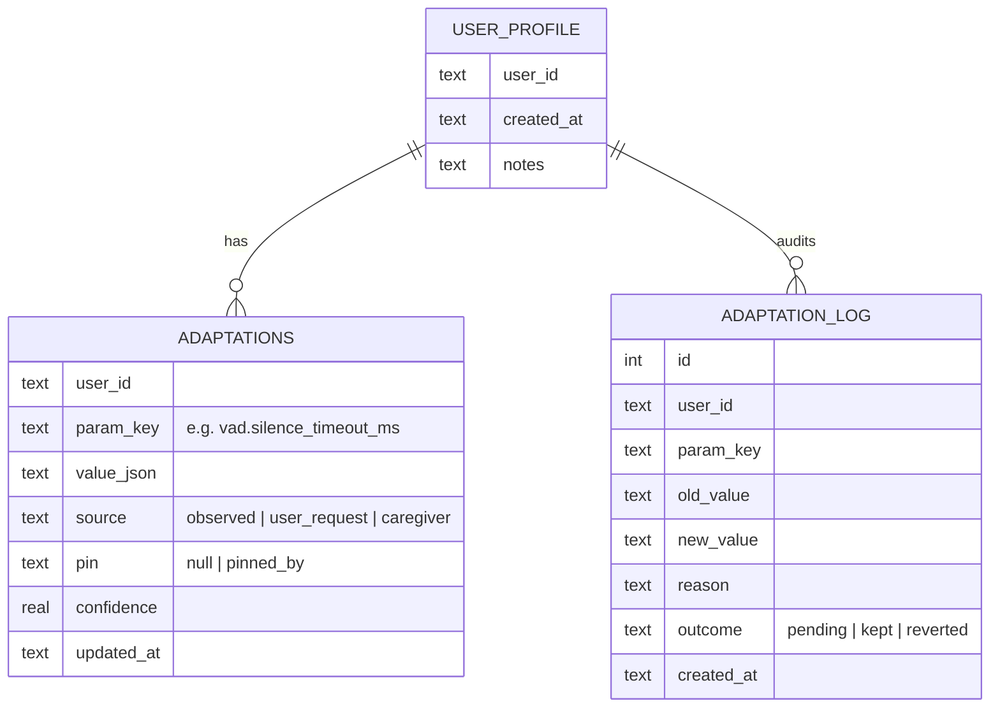
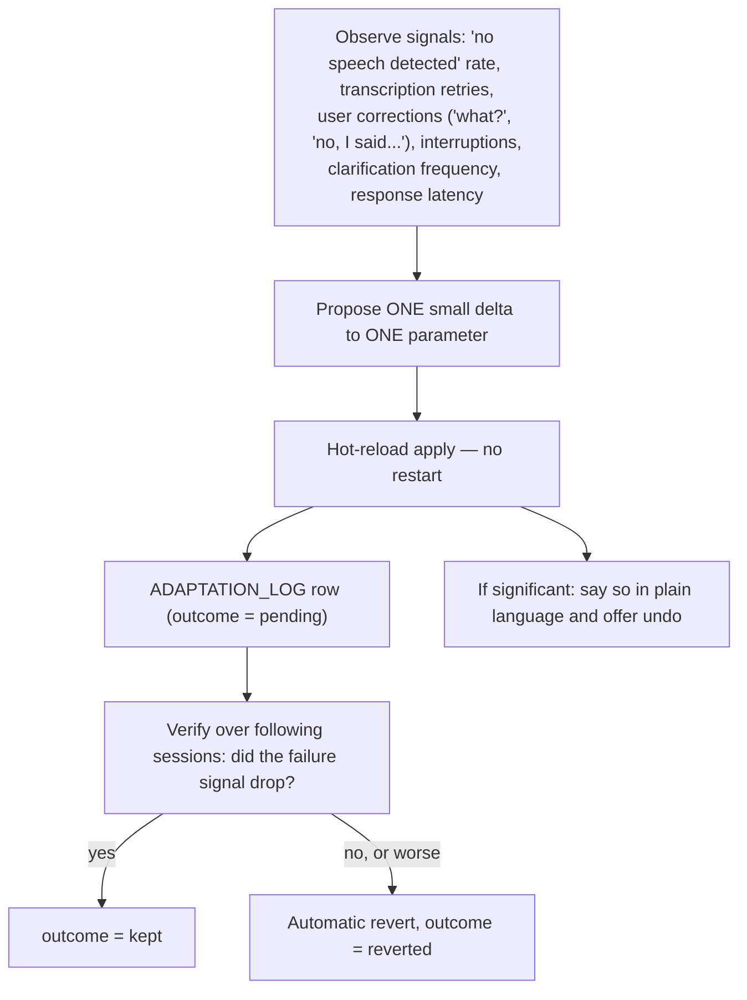

# Auxidio — User Adaptation (Configuration That Learns)

## 1. Why This Exists

The mission is to guide one specific person. People differ in exactly the dimensions the sensor layer touches: speaking rate, mumbling, stuttering, long pauses, vocabulary, hearing, processing speed. A device with fixed configuration will fail the people who differ most from its defaults — which is precisely the population it serves. Configuration therefore has to change as the system accompanies the user.

The boundary is strict and follows the two-layer doctrine:

- **The periphery adapts.** Perception, timing, and communication packaging learn continuously.
- **The core never adapts.** Base weights (50/30/20), confidence tiers, least-harm logic, security escalation, and the truth gate are frozen. No amount of observed user behavior moves them.

---

## 2. What Adapts and What Never Does

| Adapts (learned layer) | Examples |
|---|---|
| Audio capture / VAD | End-of-turn silence timeout, gain/normalization, maximum utterance length |
| Speech-to-text | Whisper `initial_prompt` hints (user's name, common vocabulary, place names), model size selection |
| Turn-taking patience | Extra wait before assuming the user has finished (stuttering, pauses, slow speech) |
| Communication style baseline | Default response length, pacing, elaboration — layered under the state-based styles from the emotional framework |
| Speech output | TTS speaking rate, voice selection |
| Clarification behavior | How readily the system asks "did you mean…?" instead of guessing |
| Classifier fast path | User-specific vocabulary added to situation keyword lists |

| Never adapts (rigid core) | Reason |
|---|---|
| 50/30/20 weights, tier boundaries | The prefrontal analog is rigid by design |
| Proportionality / least harm logic | Ethics do not personalize |
| Security log escalation | Safety is not user-tunable |
| Truth gate behavior | A transcription the system could not hear well is *less* certain, never smoothed into confidence |

That last row is the important interaction: when adaptation cannot fix a perception problem (heavy mumbling, noise), the honest consequence is a lower `confidence_rating` into the decision engine, which lands the turn in `gather_more_data` — the system asks rather than guesses. Perception problems convert into truth-gate behavior, never into fabricated understanding.

---

## 3. Profile Schema (extends the memory store)

Config resolution order, lowest to highest priority: **`harness.toml` defaults < learned ADAPTATIONS < caregiver/user pins < session overrides.** A pinned parameter beats learning — a caregiver can lock anything.

The audit log is append-only, same principle as episodic memory: the record of what changed and why is never rewritten.

---

## 4. The Adaptation Loop

Rules:

1. **One parameter at a time, small steps.** If two things change at once, nothing can be attributed.
2. **Every change is provisional** until subsequent sessions confirm it; unconfirmed changes expire back to the prior value.
3. **Revert is automatic and always available** — voice command ("undo that") and caregiver tool.
4. **Significant changes are announced**: "I have started giving you a little more time before I respond. Say 'undo' if that is wrong." The user is never silently reconfigured — truth-first applies to the system's own behavior too.
5. **Adaptation proposals come from measured signals, not vibes.** Each proposal cites its observed failure signal.

---

## 5. Worked Examples for the Mission

| User trait | Observed signal | Adaptation |
|---|---|---|
| Speaks fast, short pauses | End-of-turn detection cuts utterances mid-sentence (partial transcripts, corrections) | Lower `vad.silence_timeout_ms`; raise max utterance buffer |
| Mumbles | High transcription retry rate, frequent "I didn't catch that" | Raise input gain/normalization; add likely vocabulary to Whisper `initial_prompt`; increase clarification willingness; unresolved input lowers `confidence_rating`, never faked |
| Stutters | False turn-ends; system interrupts mid-utterance | Lengthen turn patience window (seconds, not milliseconds); never interrupt; normalize repetitions before keyword analysis |
| Needs processing time | User overwhelmed by fast/long responses | Slower TTS rate, shorter default sentences, longer wait before repeating a prompt |

---

## 6. A Flaw This Requirement Exposes (Pre-Freeze Catch)

The current `emotional_framework.py` tone-shift heuristic flags **crisis** when a previous long input is followed by a short one containing words like "wait", "stop", "hold on", "actually". For a user who stutters, communicates in short bursts, or legitimately says "wait" while thinking, this misfires — potentially shouting crisis-mode responses at an ordinary sentence.

This is caught **before** the reference freeze, so it is handled by the change mechanism already defined (`Rust Harness Design.md` §9):

1. The fix is made in the Python reference first (require explicit immediacy language for tone-shift crisis, or suppress the length-shift arm entirely when the profile carries a disfluency flag; normalize repetitions like "i i need" before matching).
2. New differential vectors are generated from the updated reference.
3. The Rust port is written to match the updated reference exactly.

The disfluency flag itself lives in `USER_PROFILE` — set by observation (repetition patterns in transcripts) or by caregiver input.

---

## 7. Harness Requirements

- All adaptive parameters are read through a config layer with hot reload; nothing is cached at startup (fixes the startup-only configuration pattern of the Phase 5 code by design).
- The session manager applies profile parameters per turn, so changes take effect mid-session without restart.
- The verifier and model clients read their parameters the same way — one resolution path, one audit trail.
