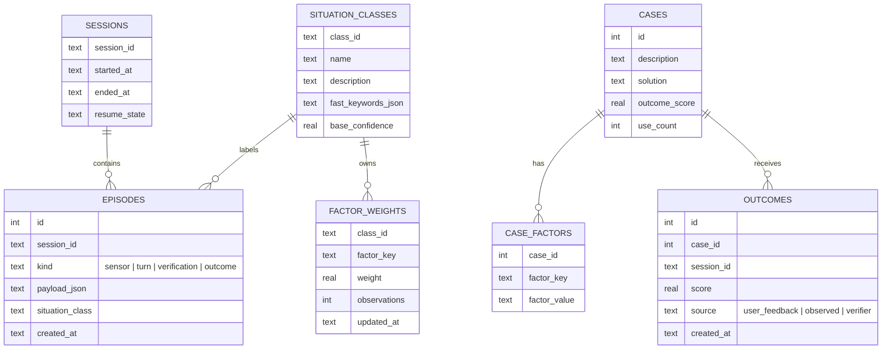
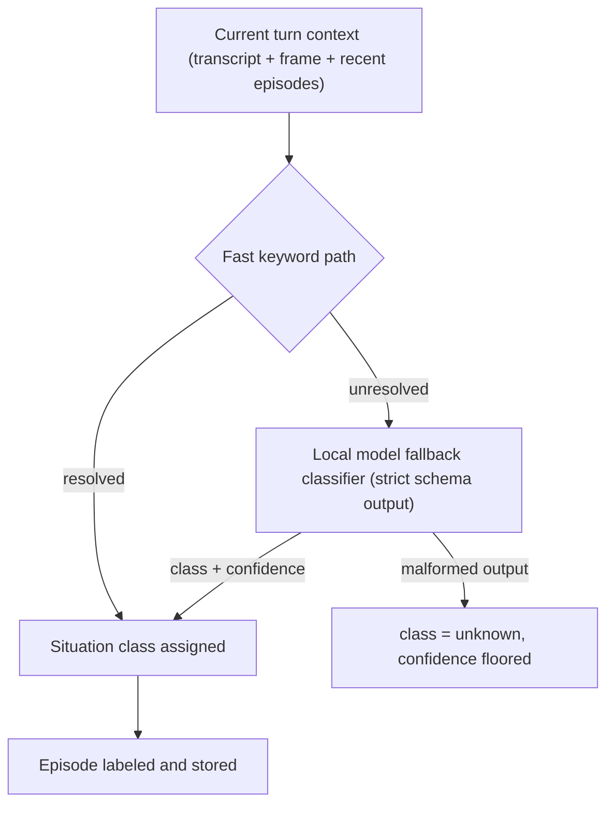
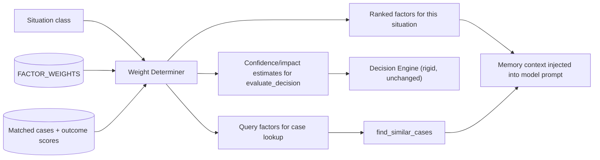
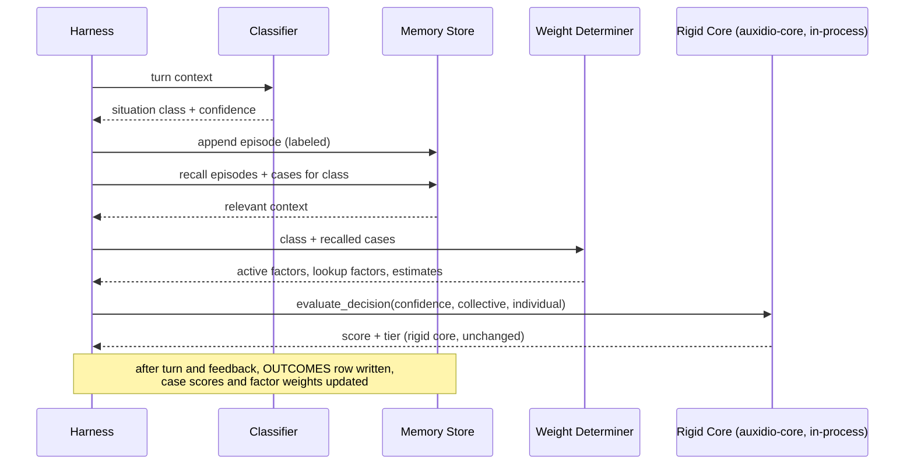

# Auxidio — Memory Structure, Situation Classification, and Weight Determination

The memory structure is what makes sessions continuous and judgment consistent over time. It extends the existing case library concept into a full store with three layers, and it is where all *learned* weights live. The rigid core's base weights (50/30/20) never live here and never change.

---

## 1. Three Memory Layers

| Layer | Content | Analogy | Mutability |
|---|---|---|---|
| Episodic | Raw and processed event log: every sensor event, transcript, frame reference, turn, and outcome | What happened | Append-only, never rewritten |
| Semantic | Distilled cases, situation classes, factor definitions — extends the existing `cases` table | What it means / what worked | Updated by outcome feedback |
| Working | Current session: rolling context, active situation class, active weights, pending verifications | What is happening now | Per-session, resumable |

The episodic layer is append-only by design: the truth gate (50%) requires an untampered record of what actually occurred. Semantic memory may be revised; history may not.

**How the user's life becomes second nature to the system.** Not by retraining the model on-device — the model stays frozen. The mechanism is this memory layer: every turn is shaped by episodic recall, matched cases, and learned factor weights. The longer the system accompanies a person, the more its learned layer encodes that person's patterns, routines, and recurring situations. The model supplies the philosophy; the memory supplies the personal knowledge. This is the same two-layer doctrine as the core: the fixed part stays fixed, and the personal learning happens in the layer beneath it.

---

## 2. Schema (SQLite, extends `case_library.py` tables)

Existing `cases` and `security_log` tables are preserved exactly; `CASE_FACTORS` normalizes the current JSON `factors` column over time without breaking `find_similar_cases`.

---

## 3. Situation Classification

Two-path design, matching Roadmap Phase 8's harden-the-classifier intent:

- Fast path: per-class keyword/feature rules (extends the existing outward-channel keyword approach). Cheap, immediate.
- Fallback: the local model returns `{class_id, confidence}` against a strict schema. Malformed output never crashes the turn — the situation is marked `unknown` and the confidence gate in the decision engine handles the rest. This is deliberate: an uncertain system that knows it is uncertain is safer than a confident one that is wrong.
- New classes can be created by the fallback when no existing class fits, but start with zero learned weights and must earn usage before their weights carry influence.

---

## 4. Weight Determination

Two kinds of weight exist and must never be conflated (per the design documents' two-layer architecture):

1. **Base weights** — truth 0.5, collective 0.3, individual 0.2. Fixed in `decision_engine.py`. The weight determiner never touches these.
2. **Factor relevance weights** — learned, per situation class, stored in `FACTOR_WEIGHTS`. These decide which situational details matter for this class of problem and feed similarity matching and case ranking.

Learning rule: weights update only through recorded outcomes (`OUTCOMES` table), via the same cumulative-average mechanism `update_outcome` already implements. No weight changes without evidence. Open testing parameter, same as elsewhere: update rate and decay.

---

## 5. Turn Flow Through Memory

---

## 6. Outcome Feedback Sources

1. **Explicit user feedback** — the Roadmap 6.2 confirmation cue ("Did that help?").
2. **Observed outcomes** — later episodic evidence that a recommended action was taken and what followed (pattern-matched by the classifier; conservative scoring).
3. **Verifier outcomes** — for arithmetic claims, the Math Verifier's pass/fail is itself an outcome signal for the truth dimension of the turn.

All three write to the same `OUTCOMES` table with distinct `source` values, so the learning layer has one mechanism regardless of signal origin.

---

## 7. Privacy and Localization

- The memory store never leaves the device. No sync, no cloud backup by default.
- Episodic data is the user's private record: retention window and purge controls are a config setting, not an afterthought.
- The store is plain SQLite on local storage; encryption-at-rest is a documented follow-on, not a launch blocker (recording as an open item rather than pretending it is solved).
- Continuous vision is the most sensitive data stream in the whole system — a device that watches over a vulnerable person constantly. Raw frames therefore exist only in a rolling buffer (minutes, configurable) and are never written to the episodic store; the store keeps frame references and text summaries. The system remembers the situation, not the footage.
