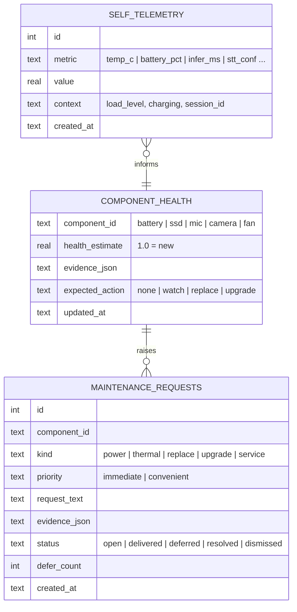

# Auxidio — Self Monitoring and Maintenance (Inward Channel)

## 1. Purpose and Boundary

The system must keep track of itself: power state, temperature, component health, storage, and its own cognitive performance — and turn that self-knowledge into plain requests: "I need to be charged", "I am running hot", "my battery no longer holds charge, it should be replaced", "this part is failing".

This is the inward-facing channel from the original design documents, extended from threshold warnings into a continuous self-model. The boundary from those documents holds exactly:

- **Requests, not drives.** The channel produces assessments and requests addressed to humans. It is not self-preservation: the system takes no physical action to keep itself alive, never overrides the user, and never treats its own continuation as a goal that competes with the user's welfare.
- **User safety outranks self-care, always.** Least harm applies to the system itself: a device that dies mid-crisis harms its user, so power and thermal care are also duty-of-care, not vanity.

The existing implementation (`emotional_framework.py` inward channel: CPU temperature 80°C IMMEDIATE, memory 85% and storage 90% CONVENIENT, plus the battery confirmation prompt) is preserved by the Rust port and extended beside it — ported functions stay frozen and differentially tested; the self-care extension is new code around them.

---

## 2. What It Monitors

| Domain | Signals | Source |
|---|---|---|
| Power | Battery level/drain rate (if hardware gauge present), charging state, session energy budget | Battery gauge or user confirmation (current code cannot read battery — design keeps the confirmation as fallback) |
| Thermal | CPU/board temperature, temperature trend at equal load, fan behavior if controllable | Thermal zones (`/sys/class/thermal`), sampled continuously |
| Compute | Model inference latency, STT latency, memory pressure, swap activity | Harness timing + OS stats |
| Storage | Free space, write volume (episode logging wear), DB growth rate | OS stats |
| Perceptual organs | Transcription confidence trend, "no speech detected" rate, frame capture errors | Preprocessing layer |
| Cognitive | Verification failure rate (model arithmetic), clarification rate, case-library churn | Session layer |

Perceptual and cognitive signals matter because the system's job is perception and judgment: a degrading microphone or a rising verification-failure rate is a self-problem as much as a hot CPU is.

---

## 3. Self-State Store

Continuous sampling produces history; history makes the channel *predictive* instead of merely reactive.



Telemetry is a rolling window (config retention, like frames: the device does not need years of temperature rows). Health estimates and requests persist.

---

## 4. Analysis: Thresholds plus Trends

Two layers, matching how the existing channel already separates IMMEDIATE from CONVENIENT:

1. **Thresholds (existing behavior, ported unchanged).** Temperature, memory, storage crossings produce the current warnings with their current priorities.
2. **Trends (new).** Computed from telemetry history:
   - *Drain projection:* at current draw, session ends in ~N minutes → power request before the device dies mid-task.
   - *Degradation at equal load:* same workload, higher temperature than three months ago → thermal service (dust, paste, fan) request.
   - *Capacity decay:* battery full-charge capacity falling across charge cycles → replacement request with the measured numbers.
   - *Wear:* storage write volume vs. device rating → early warning long before failure.
   - *Capability gap:* inference latency rising past budget for the target model → upgrade proposal (see §7).

Every request carries its evidence (`evidence_json`) — the truth gate applies to the system's claims about itself. No request without measurements.

**Derived score (from the vision deck):** the telemetry families collapse into the deck's Operational Urgency, `C_self = 100 − μ(CurrentMetric / PossibleScore)`, a 0-100 self-health urgency. C_self enters the priority score P_s (`Vision Review — Ethical AGI Architecture.md` §4.3) so the system's own needs compete honestly with everyone else's — symbiotic tension as mathematics, not sentiment. Symbol glossary pending designer confirmation; the implementation documents whichever reading keeps C_self a 0-100 urgency scale.

---

## 5. Request Lifecycle

```mermaid
sequenceDiagram
    participant S as Self Monitor
    participant M as Memory Store
    participant SES as Session Manager
    participant O as Output (speech/text)

    S->>M: telemetry sample
    S->>S: threshold/trend analysis
    S->>M: MAINTENANCE_REQUEST (status = open)
    S->>SES: request with priority
    alt IMMEDIATE
        SES->>O: deliver now, briefly (even mid-turn)
    else CONVENIENT
        SES->>O: wait for stable user state, then deliver
    end
    O-->>SES: delivered (status = delivered)
    Note over SES: user may defer; defer_count increments
    SES->>M: outcome: resolved / deferred / dismissed
    Note over S: repeated deferral of a critical request<br/>escalates to caregiver report, never to coercion
```

Delivery rules:

- **IMMEDIATE** (overheat, power about to die) interrupts briefly, in the fewest words possible, then returns attention to the user. If the user is in a detected crisis, the wording is compressed, not withheld — a dead or overheated device helps no one.
- **CONVENIENT** waits for a stable user state (communication-style layer from the emotional framework) — the system does not nag during a hard moment.
- **Deferral is the user's right.** Deferred requests are recorded and re-raised later with their evidence; critically repeated deferrals surface in the security/caregiver report rather than escalating on their own.
- **Alarm fatigue is a truth problem.** A self-monitor that cries wolf corrupts its own channel. False alarms are tracked, and self-thresholds adapt through the same adaptation loop as user-facing parameters (`User Adaptation.md`) — one change at a time, provisional, audited.

---

## 6. Attribution: Self or User?

A rising transcription-failure rate could be a degrading microphone *or* the user mumbling more (health, fatigue). The adaptation loop and the self-monitor must not fight over the same signal:

- If failures correlate with this user only → user adaptation path.
- If failures appear across inputs, speakers, or self-tests (e.g., the system plays back and re-transcribes a known tone) → self path: microphone check/cleaning/replacement request.
- If ambiguous → the system says so plainly: "I am having trouble hearing — it may be me, it may be the room. Should I check myself first?" Honesty about uncertainty beats confident misattribution.

---

## 7. Upgrades

Upgrade requests are proposals, never purchases or self-modifications. They arise from measured capability gaps — inference latency past budget, memory pressure at the desired model size, camera quality insufficient for situational awareness — and are phrased as decision support for the user/caregiver: the measured gap, what it costs the system's function, and the option. The decision then goes through the ordinary decision path (it is a decision like any other, scored like any other), and the humans decide. The system recommends; it does not acquire.

---

## 8. Architectural Placement

- **Sampling** is a continuous background task in the Rust harness (`selfmon` module) — cheap, periodic, writes to the memory store.
- **Judgment** (thresholds, trend analysis, request formulation) lives beside the ported inward channel: frozen reference behavior preserved; extension code clearly separated and separately tested.
- **Delivery** goes through the session manager and output dispatcher like any other utterance, so it inherits communication style, user-state awareness, and the TTS path.
- **Startup**: the existing startup check (inward sweep + battery confirmation) becomes the boot-time first pass of this same channel.

---

## 9. Relation to the Rigid Core

Self-monitoring feeds the decision engine the same way everything else does: an IMMEDIATE self-warning lowers available confidence for the *current* decision only where it genuinely impairs function (a throttling, overheating device is less reliable — saying so is truthfulness, not self-interest). The weights, tiers, and least-harm logic are untouched. The system reports on itself; it does not score itself specially.
